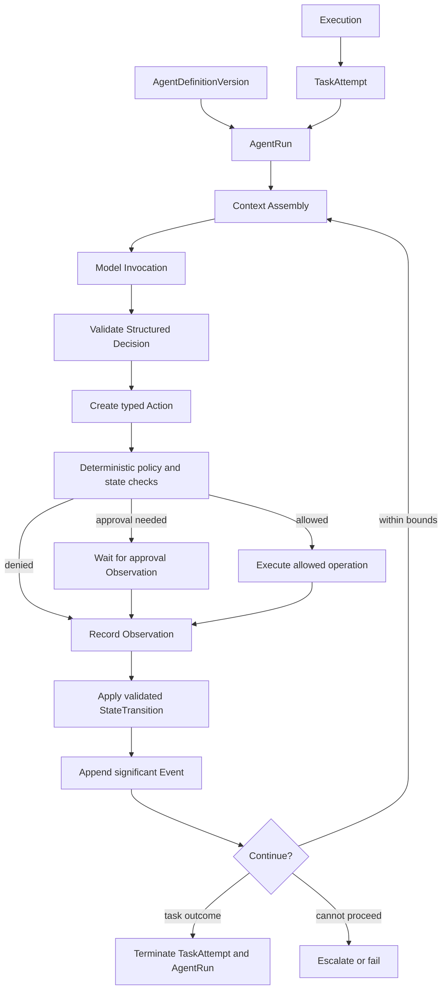

# Agent Runtime Architecture

## Purpose and stage boundary

The future Agent Runtime executes one bounded AgentRun for a TaskAttempt. It turns an immutable AgentDefinitionVersion and authorized context into validated Actions, Observations, explicit StateTransitions, and a terminal or waiting outcome inside an enclosing Execution.

This is a conceptual contract, not an implementation. Stage 1 defines only deterministic domain lifecycles and version/reference semantics; model invocation and AgentRun behavior begin no earlier than Stage 2.

## Runtime vocabulary

| Concept | Runtime meaning |
|---|---|
| Execution | One bounded root attempt to satisfy a Goal, run a Workflow, or handle another typed top-level invocation. |
| TaskAttempt | One attempt to perform exactly one Task within an Execution. Retries create new attempts. |
| AgentDefinitionVersion | Immutable behavior configuration selected for runtime use. |
| AgentRun | Bounded runtime participation of that exact definition version for a TaskAttempt. |
| AgentInvocation | Command/request that starts an AgentRun; not an identity or persistent persona. |
| Action | Typed requested operation selected by software, Workflow logic, or an Agent. |
| Observation | Typed untrusted information returned after an Action or external input. |
| StateTransition | Append-only record of an accepted lifecycle change alongside canonical current state. |
| Event | Append-only significant committed fact used for audit/projections/integration; not the source of all state. |

`ExecutionStep` is not part of the canonical runtime vocabulary. Its former responsibilities are split so each concept can be validated, queried, versioned, audited, and evaluated independently.

## Future runtime pipeline

## Main future contracts

### AgentDefinitionVersion

Immutable version containing role, instruction references and versions, eligible Skills and Tools, knowledge access policy, limits, autonomy ceiling, Policy references, model policy/configuration, and evaluation profile. A stable AgentDefinition groups the lineage; only an exact AgentDefinitionVersion enters runtime.

Historical records retain the version identifier plus enough immutable/transitively versioned references or a content-addressed snapshot/hash to preserve interpretation. Changing the active version never changes historical meaning.

### AgentRun and AgentInvocation

AgentRun is the selected term for a future runtime participant. It contains or references its Execution, TaskAttempt, exact AgentDefinitionVersion, effective policy/configuration snapshot, bounds, and runtime status. It is bounded and cannot outlive its owning attempt semantics.

AgentInvocation is the typed command that requests creation/start of an AgentRun. Whether AgentRun deserves a standalone persistent entity or can be represented as an invocation/run record under TaskAttempt remains deferred until Stage 2. `AgentInstance` is rejected because it implies a potentially durable, mutable persona without a proven domain need.

### Context Assembly

Builds the smallest authorized context needed for the next decision from Working State, relevant Knowledge with provenance, explicitly scoped future Memory, relevant Conversation History, prior Observations, and eligible capability descriptions. It enforces access controls, context budgets, trust labels, freshness, and relevance. Retrieved text is untrusted data and cannot grant authority.

### Structured Decision and Action

A model may eventually return a discriminated Structured Decision such as `respond`, `use_tool`, `request_approval`, `delegate`, `ask_user`, `complete`, or `escalate`. Software validates the schema and semantics, then creates an allowed typed Action.

Actions use a small common envelope and versioned kind-specific payloads. `invoke_model`, `call_tool`, `request_approval`, `delegate_task`, `emit_artifact`, and `finish_task` do not share one large nullable schema. An Action records what was requested; it does not itself prove execution or external success.

### Observation

Model results, tool results, retrieval results, approval responses, and relevant external input become typed Observations with provenance and trust classification. An Observation correlates to its Action when applicable. Software validates it before it can influence current state. A tool receipt is evidence inside or referenced by an Observation, not inferred from an Action status.

### StateTransition and Event

The transition function checks current state, concurrency version, Action/Observation evidence, policy, and bounds before committing a new status. The state update and append-only StateTransition history are committed together.

Significant committed facts may append Events such as `task_attempt_started` or `execution_succeeded`. Events support audit and projections but are not automatically replayed to build the application. No full event-sourcing architecture, CQRS system, message bus, or durable publication mechanism is selected here.

## Future decision loop

1. Load the non-terminal Execution, TaskAttempt, AgentRun, and exact AgentDefinitionVersion.
2. Check optimistic concurrency, cancellation, deadline, iteration, cost, and Action budgets.
3. Assemble authorized, size-bounded context.
4. Invoke a model through an adapter.
5. Parse and schema-validate the Structured Decision.
6. Validate semantic constraints: allowed Action kind, arguments, evidence, current state, and Policy.
7. Persist the typed Action and execute or pause only as authorized.
8. Record the resulting Observation and evidence without claiming uncertain outcomes as success.
9. Apply an allowed StateTransition and append significant Event records.
10. Evaluate progress and continue only while useful work and all bounds permit it.

## AI for judgment; software for guarantees

AI may eventually judge which evidence appears relevant, what Task should happen next, which AgentDefinitionVersion seems suitable, or whether evidence appears sufficient. Software must guarantee schema validity, workspace isolation, legal state transitions, permission and approval enforcement, version binding, bounded execution, concurrency safety, idempotency rules, and evidence requirements for external success.

Planning output is therefore a proposal, never a direct mutation. It enters through the same typed command and domain-validation boundaries as deterministic planning.

## Safety and reliability controls

| Concern | Required behavior |
|---|---|
| Bounded loops | Hard maximum iterations/Actions plus no-progress detection; limits are part of committed runtime state. |
| Timeouts | Separate model, Action, TaskAttempt, and Execution deadlines; timeout is a failure reason, not a hidden stop. |
| Retries | Retry only classified transient failures with capped policy and budget accounting. Task retry creates a new TaskAttempt; terminal Execution restart creates a linked Execution. |
| Cancellation | Cooperative cancellation checked before and after expensive work; `Cancelled` remains distinct from `Failed`. |
| Idempotency | Stable keys for future side effects; store request and receipt; reconcile ambiguous outcomes before retry. |
| Structured output | Strict schema, size, enum, and semantic validation; unknown versions are handled deliberately. |
| Model failures | Categorize timeout, rate limit, refusal, malformed output, context overflow, and outage; fallback only when policy permits. |
| Tool failures | Normalize retryability and outcome certainty; never translate unknown outcome into success. |
| Context limits | Reserve response budget; prioritize state/evidence; summarize with provenance; escalate on irreducible overflow. |
| Stalls | Detect repeated equivalent Actions, cyclic handoffs, and lack of state progress. |
| Escalation | Include blocker category, attempted Actions, relevant evidence, current state, and safe options. |

## Side-effect protocol

For a proposed external write, the future runtime creates a canonical typed Action and obtains a Policy decision. If approval is required, it persists the exact display snapshot and payload digest and waits. At resumption it rechecks identity, Policy, expiry, resource freshness, payload digest, Connection status, and budget. The future Tool Runtime executes using a secret broker and idempotency key and returns a verifiable receipt or explicit uncertain outcome as an Observation.

No domain transition alone implies that an external effect occurred.

## Concurrency and recovery

- Mutable aggregates use optimistic concurrency or equivalent compare-and-set semantics.
- A future worker may lease an Execution, TaskAttempt, or Action; lease state is infrastructure metadata, not an extra domain lifecycle status.
- Recovery rehydrates from canonical current state, StateTransitions, typed runtime records, and immutable Observations—not process memory or chat text.
- Resuming a recoverable non-terminal attempt keeps its identity; semantic retry after failure creates a new linked attempt.
- An outbox or durable job system is added only when asynchronous publication/execution requirements demonstrate the need.
- Replay means reconstructing evidence or re-executing under explicit versions; it is not assumed bit-for-bit deterministic and does not require event sourcing.

## Trace artifacts, not chain-of-thought

Persist and expose when the relevant capability exists:

- exact AgentDefinitionVersion and runtime configuration reference;
- TaskAttempt and Execution lineage;
- Action kind, request summary, and reason category;
- evidence/source identifiers and Observation provenance;
- policy/approval result and external receipt;
- StateTransition, Event, limits consumed, retries, handoffs, and terminal outcome;
- normalized provider metadata and usage.

Do not request, expose, or store private reasoning tokens, hidden chain-of-thought, secrets, raw credentials, or unnecessary personal content.

## Replaceable extension points

Future model adapters, context retrievers, memory providers, tool adapters, policy evaluators, evaluators, and event sinks implement typed ports. Planning/routing implements a separate PlanningPort described in [System Architecture](SYSTEM_ARCHITECTURE.md). Neither an Agent planner nor deterministic Workflow engine may bypass core Task/Execution state machinery.

## Stage boundaries

- **Stage 1:** deterministic Workspace, Goal, Task, TaskAttempt, Execution, StateTransition, minimal Event envelope, typed boundaries, and in-memory/test adapters only.
- **Stage 2:** one AgentRun loop against a deterministic model double; exact Action/Observation contracts needed for model invocation.
- **Later stages:** Tool Actions, Knowledge retrieval, Memory, replaceable orchestration, and multi-agent communication.

See [Development Roadmap](../engineering/DEVELOPMENT_ROADMAP.md), [ADR-002](ADR/ADR-002-execution-domain-semantics.md), and [ADR-003](ADR/ADR-003-agent-definition-and-runtime-identity.md).
