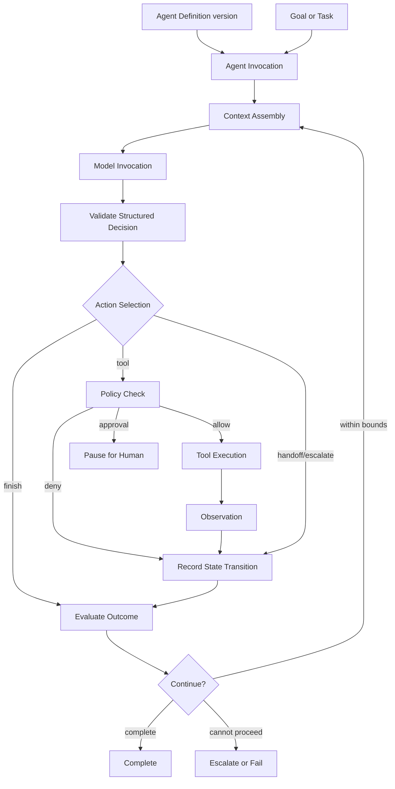

# Agent Runtime Architecture

## Purpose

The future Agent Runtime executes one bounded reasoning actor against a Goal or Task. It turns immutable configuration and authorized context into validated decisions, governed actions, observations, and explicit state transitions. This is a conceptual contract, not a Stage 0 implementation.

## Runtime pipeline

## Main contracts

### Agent Definition

Immutable version containing role, instruction references, eligible Skills and Tools, knowledge scopes, limits, autonomy ceiling, model policy, and evaluation profile. Activation resolves dependencies and validates schemas.

### Agent Invocation

Runtime envelope containing execution/instance IDs, exact definition version, Goal/Task, caller, effective policy, budgets, deadline, cancellation token, and initial context references. It contains secret references only where required; never raw unrestricted credentials.

### Context Assembly

Builds the smallest authorized context needed for the next decision from task state, selected knowledge with provenance, scoped memory, prior structured observations, and tool descriptions. It enforces access controls, token budgets, trust labels, freshness, and relevance. Retrieved text is untrusted data and cannot grant authority.

### Model Invocation

Calls a provider adapter with a versioned request contract, deadlines, sampling/configuration policy, and correlation metadata. Provider-specific message formats and usage reporting are normalized at the adapter boundary.

### Structured Decision

A discriminated result such as `respond`, `use_tool`, `request_approval`, `delegate`, `ask_user`, `complete`, or `escalate`. It contains action arguments, evidence references, confidence/uncertainty fields where useful, and a non-sensitive reason category. It does not contain or require chain-of-thought.

### Observation and state transition

Model, tool, retrieval, policy, and system results become typed Observations with provenance and trust classification. The transition function validates the prior state, decision, observation, and limits before committing the next state.

## Decision loop

1. Load immutable invocation and current committed state.
2. Check cancellation, deadline, iteration, cost, and tool-call budgets.
3. Assemble authorized, size-bounded context.
4. Invoke model through an adapter.
5. Parse and schema-validate the structured decision.
6. Validate semantic constraints: available action, arguments, evidence, current state, and policy.
7. Execute the selected deterministic action or pause/escalate.
8. Record sanitized inputs/references, result, usage, and state transition atomically enough for safe recovery.
9. Run progress/terminal evaluation.
10. Continue only if useful work remains and all bounds permit it.

## Safety and reliability controls

| Concern | Required behavior |
|---|---|
| Bounded loops | Hard maximum iterations/tool calls plus no-progress detection; limits are persisted, not process-local. |
| Timeouts | Separate invocation, model, tool, step, and total-execution deadlines; timeout is an explicit outcome. |
| Retries | Retry only classified transient failures, with capped exponential backoff/jitter and budget accounting. Do not blindly retry invalid model output or policy denial. |
| Cancellation | Cooperative cancellation checked before/after expensive steps; tool adapters declare cancellation semantics. |
| Idempotency | Stable idempotency keys for side effects; store attempt and receipt; ambiguous outcomes reconcile before retry. |
| Structured output | Strict schema, size, enum, and argument validation; unknown fields/versions handled deliberately. |
| Model failures | Categorize timeout, rate limit, refusal, malformed output, context overflow, and provider outage; fallback only when policy permits. |
| Tool failures | Normalize retryability and outcome certainty; never translate an unknown outcome into success. |
| Context limits | Reserve response budget; prioritize required state/evidence; summarize only with provenance; fail/escalate on irreducible overflow. |
| Stalls | Detect repeated equivalent decisions, cyclic handoffs, and lack of state progress. |
| Escalation | Include concise blocker category, attempted actions, relevant evidence, current state, and safe options. |

## Side-effect protocol

For a proposed external write, the runtime creates a canonical typed request and obtains a policy decision. If approval is required, it persists the exact display snapshot and payload digest, then pauses. At resumption it rechecks identity, policy, expiry, resource freshness, payload digest, connection status, and budget. The Tool Runtime executes using a secret broker and idempotency key and returns a verifiable receipt or an explicit uncertain outcome.

## Concurrency and recovery

- A worker leases an execution/step and heartbeats ownership; lease loss prevents further commits.
- State transitions use optimistic concurrency or equivalent compare-and-set semantics.
- Command acceptance and durable work publication use an outbox or equivalent consistency pattern.
- Recovery rehydrates from committed state and immutable observations, not model process memory.
- Replay means reconstructing or re-executing under explicit version semantics; it is not assumed bit-for-bit deterministic.

## Trace artifacts, not chain-of-thought

Persist and expose:

- action selected and reason category;
- evidence/source identifiers;
- normalized model/provider metadata and usage;
- tool request summary, permission result, and receipt;
- observation, validation errors, and state transition;
- limits consumed, retries, handoffs, approvals, and terminal outcome.

Do not request, expose, or store private reasoning tokens, hidden chain-of-thought, secrets, raw credentials, or unnecessary personal content.

## Runtime extension points

Model adapters, context retrievers, memory providers, tool adapters, policy evaluators, evaluators, and event sinks implement typed ports. Extension code cannot bypass central policy, state, and trace contracts.

## Stage boundaries

Stage 1 defines types and state machines. Stage 2 implements a single-agent loop against deterministic doubles. Later stages add tools, knowledge, memory, and orchestration in that order. See [Development Roadmap](../engineering/DEVELOPMENT_ROADMAP.md).
