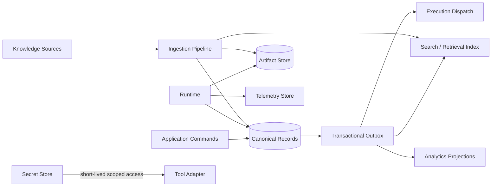

# Data Architecture

## Principle

Data categories have different consistency, access, lifecycle, size, query, and security needs. A single physical store may serve several categories initially, but their logical contracts and retention policies remain separate.

| Category | Examples | Primary needs | Why it is distinct |
|---|---|---|---|
| Application data | Workspaces, users, memberships, definitions, policies, connections metadata | Transactions, relational integrity, versioning, tenant isolation | Canonical business configuration with strong consistency. |
| Execution state | Goals, Tasks, TaskAttempts, Executions, current statuses, StateTransitions, approvals, and later Actions/Observations | State-machine integrity, concurrency control, retry lineage, and recovery | Distinct typed records; no generic ExecutionStep payload and no queue/cache as canonical state. |
| Knowledge | Source metadata, normalized content, chunks, structured facts, provenance, indexes | Hybrid retrieval, source ACLs, freshness, deletion propagation | Persistent externally grounded information; indexes are derived. |
| Memory | Scoped retained experiences, confidence, provenance, expiry, review status | Promotion rules, temporal queries, decay/retention, privacy | Derived from experience; not equivalent to knowledge or scratch state. |
| Artifacts | Reports, drafts, exports, images/files | Large-object storage, content types, checksums, version/retention | Large immutable blobs are inefficient and risky in trace rows. |
| Logs/telemetry | Structured logs, traces, metrics, audit events | Append-heavy ingestion, sampling, correlation, controlled retention | Operational data has different volume and access patterns; audit records require stronger integrity. |
| Evaluation data | Fixtures, datasets, evaluator versions, scores, annotations | Reproducibility, lineage, comparison, restricted review access | Must remain stable across runtime changes and identify exact subjects. |
| Secrets | OAuth tokens, API keys, encryption materials | Encryption, scoped retrieval, rotation, access audit, no general query | Agents and normal data stores must never expose credential material. |

## Data flow and derived stores

Canonical records win over queues, caches, indexes, graph views, and analytics projections. Rebuild procedures and lag/freshness metadata are required for derived stores.

## Tenancy and authorization

- Every tenant record and object key is workspace-scoped; enforcement must exist in application/data paths, not naming convention alone.
- Background jobs carry explicit workspace and actor/service identity.
- Search and knowledge retrieval apply authorization before returning content, with defense-in-depth filtering.
- Cross-workspace administrative operations are separately privileged and audited.
- Test suites include adversarial tenant-isolation cases.

## Consistency and lifecycle

- Definition versions and completed observations/evaluations are immutable; corrections create superseding records.
- State changes validate allowed transitions and concurrency version.
- External effects use idempotency records and receipts; ambiguous outcomes remain explicit.
- Retention is category- and workspace-specific. Deletion propagates to artifacts, retrieval indexes, caches, and derived analytics subject to documented legal/audit constraints.
- Backups, restore tests, encryption, regional needs, and recovery objectives become deployable requirements before production.

## Knowledge architecture

A Knowledge Source retains origin, ownership, ACL, content checksum/version, extraction status, freshness, and provenance. Derived representations may include full-text indexes, embeddings, structured fields, summaries, and entity links. Retrieval combines methods based on query type and returns references to source locations. Embeddings are an index, not authoritative content.

## Memory architecture

Memory is accepted only through a promotion policy that defines type, scope (workspace/user/agent/task), provenance, confidence, sensitivity, retention, and review requirements. Working state remains in Execution records. Source facts remain Knowledge. A Memory Entry can be superseded or expire and must not silently override fresher authoritative state.

## Candidate storage options (not decisions)

| Need | Candidate | Advantages | Costs / questions |
|---|---|---|---|
| Canonical application/execution data | PostgreSQL | Transactions, constraints, JSON where needed, mature tenancy patterns | Schema evolution, write hotspots, operational ownership |
| Coordination/cache | Redis | Fast leases/cache/rate counters | Separate consistency model; persistence/cluster overhead; should not be sole truth |
| Artifact/content blobs | S3-compatible object storage | Cheap durable blobs, checksums, lifecycle rules | Access signing, local dev, deletion coordination |
| Semantic index | pgvector | Low initial operational burden near metadata | Retrieval scale/features and index tuning |
| Search | PostgreSQL full text or dedicated engine | Hybrid filtering/search | Dedicated engine adds replication and consistency work |
| Telemetry | OpenTelemetry-compatible backend | Portable signals and correlation | Cost, sampling, sensitive-data controls |
| Secrets | Cloud secret manager/Vault-like service | Rotation, audit, scoped access | Environment coupling and developer experience |

Stage-specific ADRs should select the minimum set that meets measured needs.

## Backup and recovery expectations

Before production, define recovery point/time objectives by category, perform restore drills, verify artifact/canonical-record consistency, protect encryption keys separately, and document which derived stores are rebuilt rather than restored.
