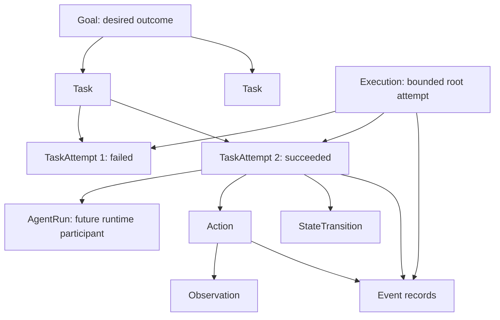
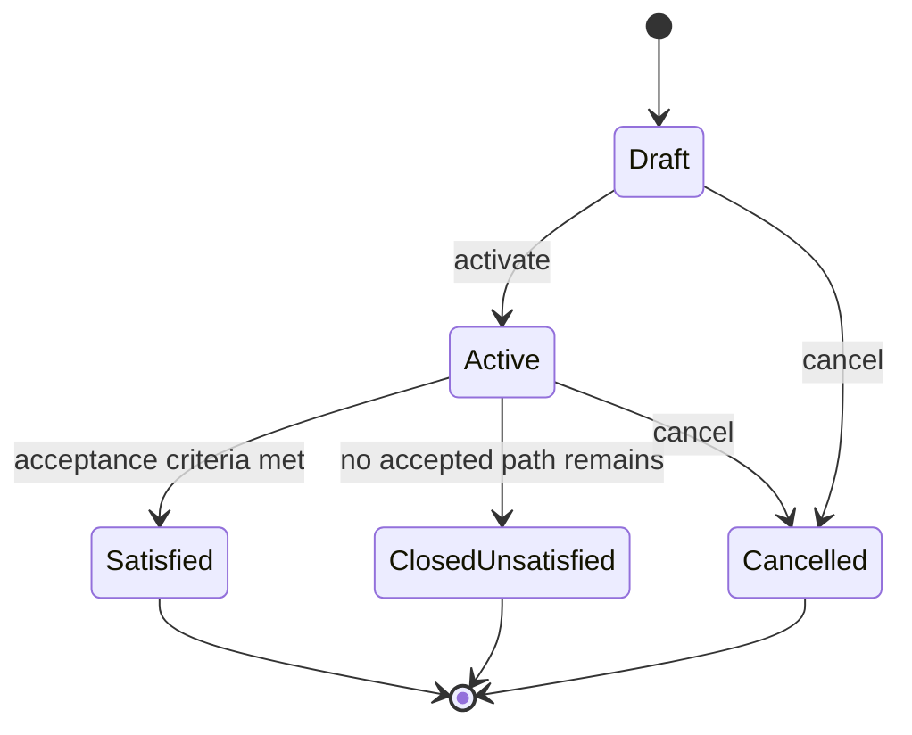
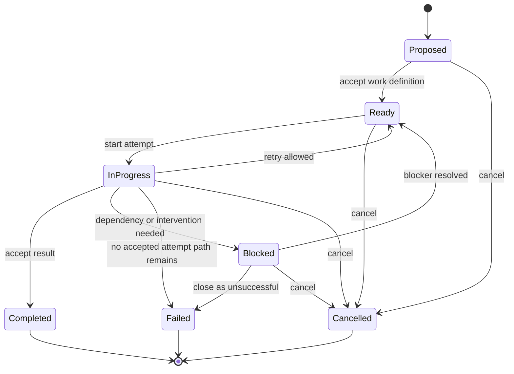
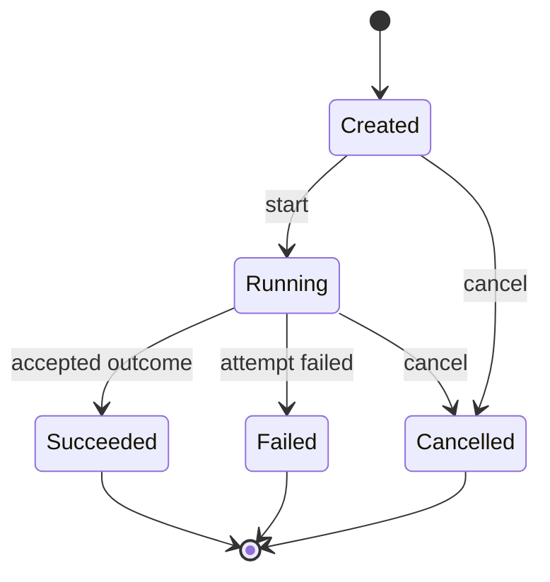
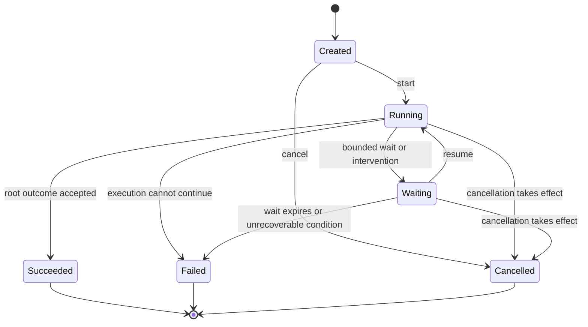
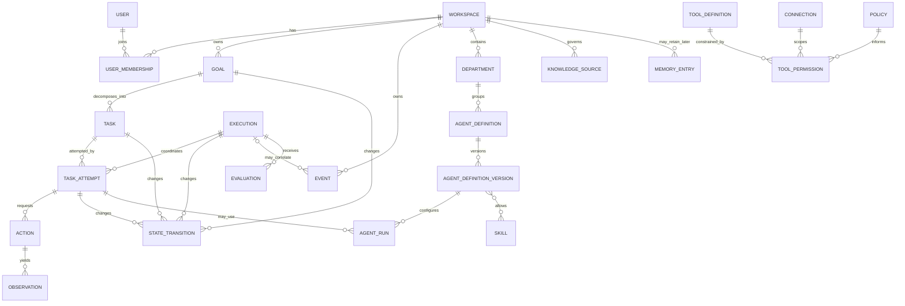

# Domain Model

## Stage 4 implemented knowledge extension

The existing Goal/Task/TaskAttempt/Execution/AgentRun semantics are unchanged.
[ADR-007](ADR/ADR-007-company-brain-and-knowledge-retrieval.md) adds KnowledgeSource
(workspace-scoped stable identity with active/disabled state), immutable
KnowledgeSourceVersion and KnowledgeChunk, explicit KnowledgeScope on immutable agent
configuration, and immutable workspace/run-bound EvidencePack. Source content version
is distinct from its optimistic status/mutation Version. KnowledgeQuery and ranked
EvidenceCandidate are typed value contracts, not Actions, Tasks, or generic steps.

Source/chunk lineage cannot cross workspaces; updates append versions, never overwrite
history. New retrieval uses active/latest permitted versions, while historical pack
reads preserve exact versions. Grounding requires exact structured-fact membership in
the active authorized pack. Disablement revokes use without erasing audit. Source and
pack state/audit commit atomically; a domain transition never claims an external action
occurred. Knowledge data cannot change agent grants, and learned Memory is not added.

## Modeling rules

- Every workspace-owned entity carries a `workspace_id`; cross-workspace references are invalid.
- Logical definitions are separate from their immutable versions and from runtime participation.
- Goal and Task describe intended work; Execution and TaskAttempt describe attempts to perform it.
- Action, Observation, and StateTransition have distinct contracts. There is no generic `ExecutionStep` entity.
- Significant committed facts may produce append-only Event records, but current state remains canonical; the application is not event-sourced by default.
- References to behavioral configuration bind immutable versions, not mutable “latest” aliases.
- Mutable records use optimistic concurrency/version guards. Fields below are conceptual, not database columns or migrations.

## Work, attempts, and runtime records

### Goal

A Goal expresses a desired outcome at the level of success, not implementation steps—for example, “Produce an evidence-backed competitor analysis.” It may carry an objective, constraints, acceptance criteria, priority, budget, deadline, requester, and status.

- A Goal owns zero or more Tasks in the initial model. A Task belongs to exactly one Goal; reuse happens through templates or references, not by sharing a live Task across Goals.
- A Goal may exist before planning, Tasks, or any Execution.
- A failed TaskAttempt or Execution does not automatically close the Goal. The Goal can remain active while an alternative Task or retry remains permitted.
- Goal satisfaction is an explicit domain decision against acceptance criteria, not a side effect of the last Task finishing.

Initial Stage 1 lifecycle:

`Failed` is deliberately not the Goal status: attempts fail, while an outcome may remain achievable. `ClosedUnsatisfied` records an explicit conclusion that the Goal was not achieved. Terminal Goals do not silently reactivate; a future reopen operation would need an explicit audited transition or a new Goal.

### Task

A Task is a bounded logical unit of work created to help satisfy one Goal—for example, “Research competitor pricing.” It may have inputs, acceptance criteria, dependencies, priority, parent/child decomposition references, assignment state, and status.

- Tasks can be created before an Execution and can depend only on Tasks in the same workspace and Goal in the initial model.
- A Task may be delegated or decomposed without changing its acceptance criteria; assignments and handoffs are explicit records.
- A Task can have multiple TaskAttempts. Retrying creates a new attempt; it does not erase the failed attempt.
- A failed TaskAttempt returns the Task to `Ready`, moves it to `Blocked`, or contributes to an explicit Task failure according to deterministic policy. It does not automatically fail the Goal.
- A Task completes only after its acceptance criteria are explicitly accepted. Completion of child Tasks alone does not imply parent completion.

Initial Stage 1 lifecycle:

### TaskAttempt

A TaskAttempt is one concrete attempt to perform exactly one Task within exactly one Execution. It separates stable logical work from retry history.

Conceptual identity includes its Task, Execution, ordinal/attempt relationship, assignee/runtime reference when applicable, start/end timing, status, outcome/failure reason, and concurrency version. A retry creates a new TaskAttempt linked to the prior attempt; a crash recovery that resumes committed in-progress state is not automatically a new attempt. Stage 1 permits at most one non-terminal TaskAttempt per Task; speculative parallel attempts are deferred.

Initial Stage 1 lifecycle:

Timeout is a failure reason, not a separate TaskAttempt status. This keeps the state space small while retaining diagnostic precision.

### Execution

An Execution is one bounded root attempt by the runtime to satisfy a Goal, run a Workflow, or handle another explicitly typed top-level invocation. In the MVP path, one Execution may coordinate several TaskAttempts for one Goal. An Execution is not a Task retry and does not collapse all child records into a generic timeline object.

- It belongs to one Workspace and records its initiating owner/principal.
- It references its root subject (for example Goal and later Workflow version), bounds, trigger, timestamps, status, outcome/failure reason, cancellation metadata, and concurrency version.
- It contains or correlates TaskAttempts, Actions, Observations, StateTransitions, Events, approvals, artifacts, evaluations, and future AgentRuns.
- Resuming from `Waiting` or recovering the same committed attempt retains the Execution identity. Retrying/restarting after a terminal state creates a new Execution linked through `retry_of_execution_id` or equivalent lineage.
- Cancellation is an explicit request and terminal outcome; it is distinct from failure. Child work receives cancellation, but adapters must report whether an in-flight external effect could be stopped.

Initial Stage 1 lifecycle:

Timeout is recorded as a failure reason (for example `deadline_exceeded`), not a seventh status. Queue/lease state belongs to future execution infrastructure and is not part of the Stage 1 domain lifecycle.

### Action

An Action is a requested operation selected by deterministic application logic, future Workflow logic, or a future Agent. Candidate kinds include `invoke_model`, `call_tool`, `request_approval`, `delegate_task`, `emit_artifact`, and `finish_task`.

Action is a future canonical runtime record because approvals, idempotency, auditing, and evaluation need the exact requested operation. It uses a small common envelope plus a versioned kind-specific payload; it is not a nullable mega-object with fields for every action kind. An Action belongs to an Execution and normally a TaskAttempt. Action schemas and lifecycle are deferred to the stage that implements the corresponding runtime capability; Stage 1 does not implement Actions.

### Observation

An Observation is immutable, typed information returned to the runtime after an Action or from an external input. Examples include a model structured result, tool result, retrieval result, external API response, or approval response.

An Observation records provenance, trust classification, schema version, timing, and a payload/reference. It belongs to an Execution and may correlate to a TaskAttempt and Action. It is data, not automatically a trusted instruction or proof of success. Observation is a future canonical runtime record; Stage 1 need not implement its payload families.

### StateTransition

A StateTransition is an append-only record of an accepted lifecycle change for a Goal, Task, TaskAttempt, or Execution. It records subject, prior/new status, reason category, actor/correlation, concurrency versions, and time. Current status is stored on the subject for direct invariant enforcement and querying; the transition record provides history and audit evidence.

This deliberate duplication avoids replaying every Event to determine current state while making lifecycle changes explicit. The state update and StateTransition append must be committed atomically within the chosen persistence boundary. Stage 1 implements the minimal transition record needed to test domain behavior.

### Event

An Event is an append-only record that a significant fact was committed, such as `execution_started`, `task_attempt_started`, `action_requested`, `approval_requested`, `task_failed`, or `execution_succeeded`. Events may reference StateTransitions, Actions, and Observations rather than copying their full payloads.

Events support audit, integrations, projections, and later observability. They do not become the automatic source of truth, and their adoption does not imply event sourcing, CQRS, a message bus, or distributed delivery. Stage 1 may define and store a minimal versioned Event envelope through an in-memory/test adapter; durable publication and delivery semantics are deferred until required.

## Agent configuration and runtime identity

| Concept | Meaning | Stage 1 treatment |
|---|---|---|
| AgentDefinition | Stable workspace-scoped logical identity and lineage for an agent configuration, including name and lifecycle metadata. | May exist as a minimal type-level concept; no behavior. |
| AgentDefinitionVersion | Immutable published behavior configuration: role/description, instruction reference and version, allowed Skill/Tool references, knowledge access policy, autonomy ceiling, Policy references, and model policy/configuration. Activation/deprecation metadata does not mutate this payload. Exact fields are deferred. | Define identity/reference semantics only if needed to prove historical binding. |
| AgentRun | Future runtime participation created from exactly one AgentDefinitionVersion for one TaskAttempt/Execution. It holds effective runtime configuration/reference and runtime status. | Not implemented in Stage 1. Persistence as a separate entity versus an invocation record is deferred. |

`AgentInstance` is rejected as canonical terminology because it suggests a durable, mutable object or long-lived persona. `AgentRun` more clearly communicates bounded runtime participation. `AgentInvocation` means the command/request that starts a run, not the runtime identity itself.

Historical Executions and TaskAttempts must retain the exact AgentDefinitionVersion identifier and enough immutable referenced configuration (or a content-addressed snapshot/hash) to interpret behavior after later definition changes.

## Other core entities

| Entity | Purpose | Major conceptual fields | Relationships | Lifecycle |
|---|---|---|---|---|
| Workspace | Isolation, ownership, policy, and configuration boundary | id, name, status, settings, retention policy | owns all workspace data and memberships | created → active → suspended → archived/deleted |
| User | Human identity participating in Workspaces | id, identity-provider refs, status | joins through membership/roles; initiates/approves work | invited/created → active → disabled |
| Department | Organizational grouping, defaults, and reporting scope | id, name, purpose, parent ref, policy refs | groups AgentDefinitions; may nest later | draft → active → archived |
| Skill | Reusable versioned capability/procedure | logical id, version, purpose, contracts, instruction/composition ref, required tool capabilities | referenced by AgentDefinitionVersions/Workflow definitions | draft → validated → active → deprecated |
| ToolDefinition | Typed executable capability contract | logical id, version, operation, schemas, risk/side-effect class, timeout/retry semantics, required scopes | granted through ToolPermission; selected by Actions later | draft → verified → active → disabled/deprecated |
| ToolPermission | Grant or denial constraining tool use | id, subject, tool/operation, resource scope, conditions, autonomy ceiling, approval rule, validity | links policy subject to ToolDefinition and optional Connection | proposed → active → revoked/expired |
| Workflow | Versioned defined process of deterministic and agentic work | logical id, version, trigger, plan/structure, contracts, compensation rules | may create Tasks/Actions through a replaceable strategy/runtime | draft → validated → active → deprecated |
| KnowledgeSource | Governed external or uploaded source of persistent facts/content | id, type, locator, owner, access policy, provenance, freshness, ingestion status, content refs | produces derived representations; queried later | registered → ingesting → ready/stale/error → disabled/deleted |
| MemoryEntry | Future retained experience-derived information | id, type, scope, content/ref, provenance, confidence, source execution, retention, review state | ownership and promotion remain deferred | proposed → validated/active → superseded/expired/deleted |
| Policy | Versioned rules governing access and behavior | logical id, version, scope, rule/effect, priority, conditions, effective period | evaluated for actors/resources/actions; may require Approval | draft → tested → active → superseded/retired |
| ApprovalRequest | Exact proposed Action awaiting human authorization | id, execution/action, payload digest/display snapshot, risk, policy basis, approvers, expiry, decision | blocks an Action; decided by User | pending → approved/rejected/expired/cancelled/invalidated → consumed |
| Evaluation | Versioned assessment of behavior/output | id, evaluator/version, subject/ref, dataset case, criteria, scores, findings, provenance | attaches to Execution, TaskAttempt, Action, Artifact, or definition version | queued → running → passed/failed/error; immutable result |
| Connection | Workspace-scoped reference to external authorization | id, provider, owner, granted scopes, secret reference, status, health metadata | used by future Tool Runtime; constrained by ToolPermissions | pending → active → degraded/expired/revoked |

## Supporting concepts

- **Artifact:** user-meaningful immutable or versioned output stored outside trace payloads and linked by reference.
- **Membership/Role:** association of User and Workspace that contributes authorization claims.
- **Handoff:** recorded transfer of Task responsibility and scoped context/artifact references; not unstructured agent chat.
- **Definition alias:** mutable pointer such as “active Research agent”; always resolved to an immutable AgentDefinitionVersion before runtime use.

## Conceptual relationships

The diagram shows conceptual cardinality, not tables. Associations may later need explicit versioned records.

## Domain invariants

### Workspace

1. Every workspace-owned entity has exactly one Workspace.
2. Every relationship between workspace-owned entities must remain inside one Workspace. Cross-workspace IDs are invalid even if they exist.
3. Commands, queries, StateTransitions, Events, and future runtime records carry explicit workspace context.

### Goal

4. Goal acceptance criteria describe outcome success rather than implementation steps.
5. A terminal Goal cannot return to `Active` without a separately defined and audited reopen operation; Stage 1 provides no reopen transition.
6. TaskAttempt or Execution failure does not by itself mark a Goal `ClosedUnsatisfied`.

### Task

7. A Task belongs to exactly one Goal in the initial model and has explicit acceptance criteria.
8. A Task has exactly one current lifecycle status; it cannot be both running and completed.
9. Task dependencies and parent/child references stay inside the same Workspace and Goal and must not form a cycle under the initial validation policy.
10. Delegation changes responsibility, not Task identity, Goal ownership, or authority.

### TaskAttempt

11. A TaskAttempt belongs to exactly one Task and one Execution.
12. A TaskAttempt binds the relevant assignee/runtime configuration version when one exists.
13. After termination, attempt facts and outcome are historically immutable except explicitly allowed audit annotations; a retry creates a new attempt.
14. Stage 1 permits at most one non-terminal TaskAttempt per Task; any future speculative parallel-attempt policy requires a separate decision.

### Execution

15. An Execution has one bounded lifecycle status, explicit limits, and an explicit terminal outcome.
16. `Failed` and `Cancelled` are distinct terminal states; timeout is a categorized failure reason.
17. A terminal Execution never resumes. Retry/restart creates a new linked Execution; crash recovery of the same non-terminal attempt retains identity.
18. Mutable lifecycle updates use optimistic concurrency/version guards so concurrent writers cannot silently overwrite state.

### Runtime records and historical configuration

19. Action, Observation, StateTransition, and Event are not interchangeable and cannot be stored as an untyped `ExecutionStep` payload.
20. An Observation is untrusted data until validated; it does not automatically prove external success.
21. Current entity status plus StateTransition history is canonical. Events are append-only facts/projections and do not imply event sourcing.
22. Historical runtime participation binds an immutable AgentDefinitionVersion and its immutable/transitively versioned behavior references; a mutable alias is insufficient.

### External side effects

23. No Goal, Task, TaskAttempt, Execution, Action, StateTransition, or Event status alone proves an external side effect occurred.
24. A future Tool action may claim external success only with a verified receipt or reconciliation evidence; ambiguous outcomes remain explicit.
25. A future retryable side-effect Action requires an idempotency strategy or explicit non-retryable classification.

### Knowledge and memory

26. Working State, Conversation History, Episodic Memory, Semantic Memory, and authoritative Knowledge are distinct concepts.
27. Stage 1 entities contain only deterministic state required for lifecycle behavior; no generic `memory` or `agent_memory` field is allowed.
28. Future agent-generated Memory cannot silently override authoritative Knowledge.

## Deliberately unresolved modeling choices

AgentRun persistence, detailed Action/Observation schemas, Event delivery/retention, Workflow representation, memory ownership and promotion, department hierarchy, definition activation UX, and agent-to-agent message representation remain open in [Open Questions](../project/OPEN_QUESTIONS.md). See [ADR-002](ADR/ADR-002-execution-domain-semantics.md) and [ADR-003](ADR/ADR-003-agent-definition-and-runtime-identity.md).
