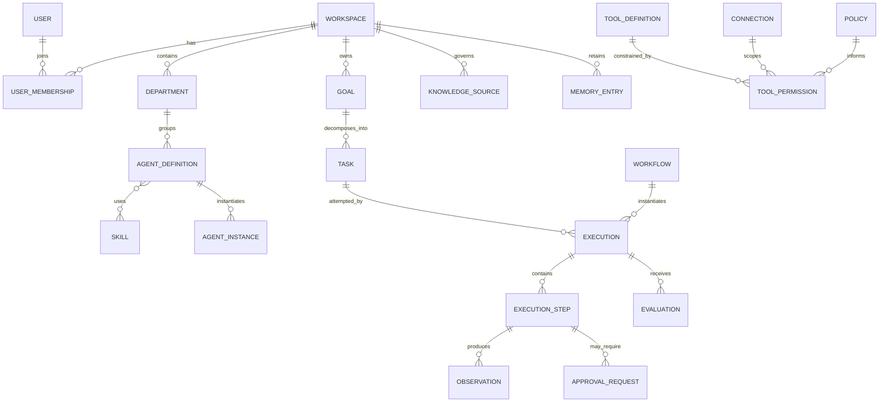

# Domain Model

## Modeling rules

- Every tenant-owned entity carries a `workspace_id`; identifiers are opaque and globally unique.
- Definitions are versioned separately from runtime instances.
- Executions and approvals are append-oriented records with explicit state transitions.
- References to definitions bind immutable versions, not mutable “latest” aliases.
- Timestamps, actor attribution, and optimistic concurrency/version fields are assumed where mutable state exists.
- Fields below are conceptual, not database columns or migrations.

## Core entities

| Entity | Purpose | Major conceptual fields | Relationships | Lifecycle |
|---|---|---|---|---|
| Workspace | Isolation, ownership, policy, and billing/configuration boundary | id, name, status, settings, retention policy | has Users/memberships, all tenant objects | created → active → suspended → archived/deleted |
| User | Human identity participating in workspaces | id, identity-provider refs, status | joins Workspaces through membership/roles; acts on Approvals | invited/created → active → disabled |
| Department | Organizational grouping, defaults, and reporting scope | id, name, purpose, parent ref, policy refs | contains Agent Definitions; may nest | draft → active → archived |
| AgentDefinition | Immutable versioned configuration of a reasoning role | logical id, version, role, instructions ref, skill refs, tool eligibility, knowledge scopes, limits, autonomy ceiling, evaluation profile | assigned to Department; creates Agent Instances | draft → validated → active → deprecated/retired; versions immutable after activation |
| AgentInstance | Runtime identity for one invocation/session boundary | id, agent definition version, invocation context, effective policy, state | acts within an Execution; receives Tasks | created → running/paused → completed/failed/cancelled/escalated |
| Goal | Desired outcome with constraints and acceptance criteria | id, statement, criteria, priority, deadline, budget, requester, state | decomposes into Tasks; may start Workflow/Execution | draft → accepted → active → achieved/failed/cancelled |
| Task | Bounded unit of work | id, title, inputs, criteria, dependencies, assignee, priority, state | belongs to Goal; has Executions; may hand off | proposed → ready → assigned → running/blocked → completed/failed/cancelled |
| Skill | Reusable versioned capability/procedure | logical id, version, purpose, input/output contracts, instructions or composition ref, required tool capabilities | referenced by Agent Definitions/Workflow steps | draft → validated → active → deprecated |
| ToolDefinition | Typed executable capability contract | logical id, version, operation, input/output schemas, risk class, side-effect class, timeout/retry semantics, required connection/scopes | granted through Tool Permission; executed in steps | draft → verified → active → disabled/deprecated |
| ToolPermission | Grant or denial constraining tool use | id, subject, tool/operation, resource scope, conditions, autonomy ceiling, approval rule, validity | links policy subject to Tool Definition and optional Connection | proposed → active → revoked/expired |
| Workflow | Versioned directed process of deterministic and agentic steps | logical id, version, trigger, graph/sequence, step contracts, compensation rules | instantiates Executions; references Tools/Agents/Skills | draft → validated → active → deprecated |
| Execution | Concrete attempt to fulfill a Goal, Task, Workflow, or operation | id, kind, subject ref/version, parent/root refs, trigger, state, limits, timestamps, outcome, artifact refs | contains Execution Steps, Observations, Approvals, Evaluations | accepted → queued → running ↔ paused/waiting → completed/failed/cancelled/escalated/timed_out |
| ExecutionStep | Atomic recorded runtime transition or action attempt | id, execution id, sequence, type, input refs, status, attempt, idempotency key, timing, output/error refs | belongs to Execution; emits Observations; may request Approval | pending → running → succeeded/failed/skipped/cancelled |
| Observation | Immutable, sanitized fact returned to runtime | id, step id, category, structured payload/ref, provenance, trust classification, timestamp | produced by model/tool/context/system; informs state | appended; corrected by superseding record, not mutation |
| KnowledgeSource | Governed external or uploaded source of persistent facts/content | id, type, locator, owner, access policy, provenance, freshness, ingestion status, content refs | produces indexed representations/chunks; queried by context assembly | registered → ingesting → ready/stale/error → disabled/deleted |
| MemoryEntry | Retained experience-derived information | id, type, scope, content/ref, provenance, confidence, created-by execution, retention/expiry, review state | may reference Agent/User/Workspace/Goal | proposed → validated/active → superseded/expired/deleted |
| Policy | Versioned rule set governing access and behavior | logical id, version, scope, rule/effect, priority, conditions, effective period | evaluated for actors/resources/actions; may require Approval | draft → tested → active → superseded/retired |
| ApprovalRequest | Exact proposed action awaiting human authorization | id, execution/step, payload digest and display snapshot, risk, policy basis, eligible approvers, expiry, decision | blocks a step; decided by User | pending → approved/rejected/expired/cancelled/invalidated → consumed |
| Evaluation | Versioned assessment of behavior/output | id, evaluator/version, subject execution/artifact, dataset case, criteria, scores, findings, provenance | attaches to Execution, Step, artifact, or definition version | queued → running → passed/failed/error; immutable result |
| Connection | Workspace-scoped reference to an external system authorization | id, provider, owner, granted scopes, secret reference, status, health metadata | used by Tool Runtime; constrained by Tool Permissions | pending → active → degraded/expired/revoked |

## Supporting concepts

- **Artifact:** user-meaningful immutable or versioned output (report, draft, file) stored outside trace payloads and linked by reference.
- **Membership/Role:** association of User and Workspace that contributes authorization claims.
- **Handoff:** recorded transfer of Task responsibility and context references; not unstructured agent chat.
- **Definition alias:** mutable pointer such as “active Research agent”; resolved to an immutable version before execution.

## Conceptual relationships

The many-to-many associations shown conceptually may require explicit versioned association entities.

## State invariants

1. Terminal execution states do not transition back to running; a retry creates a new attempt linked to its predecessor.
2. A step with an external side effect has an idempotency key or is explicitly classified non-retryable.
3. An Approval Request authorizes only the displayed payload digest, operation, connection/resource scope, and validity window.
4. Agent effective permission can only narrow, never widen, parent workspace/user/policy authority.
5. An Observation is data, not automatically trusted instruction.
6. Knowledge retrieval returns provenance and enforces source access at query time.
7. Memory promotion is a governed state change; runtime scratch data is not automatically durable memory.
8. Deleting or revoking a Connection prevents new calls while retaining sanitized historical audit evidence according to policy.

## Deliberately unresolved modeling choices

Storage layout, event sourcing, workflow graph representation, memory ownership, department hierarchy constraints, definition versioning UX, and agent-to-agent message representation remain open in [Open Questions](../project/OPEN_QUESTIONS.md).
