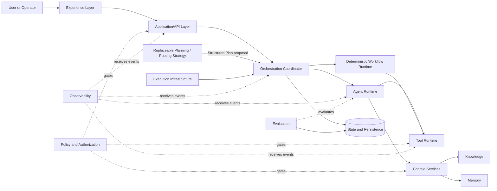
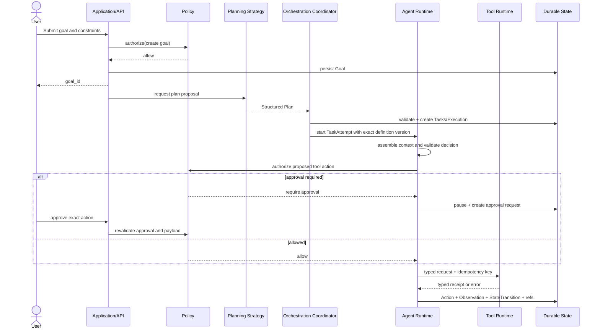

# System Architecture

## Implemented Stage 6 orchestration boundary

`OrchestrationService` is an application-layer coordinator above the existing domain
and Agent Runtime. It invokes a replaceable `OrchestrationStrategyPort`, treats the
returned `PlanProposal` as untrusted, validates it in deterministic domain code, and
materializes an immutable accepted `PlanVersion` through normal Task/Execution use
cases. `AgentSelector`, `ResultAggregator`, and `OrchestrationStore` are separate ports.

The supplied production-shaped strategy is deterministic (`ResearchBriefPlanStrategy`);
the second adapter is a scripted fake for conformance and failure tests. No model-driven
planner is implied. The planner cannot write canonical state, select beyond published
capabilities/grants, widen permissions, execute tools, or mark Goals complete.
Dependency scheduling, bounds, stale-version guards, selection, retries, replan history,
and completion are software guarantees. The Stage 6 adapter is in-process and shares
the atomic in-memory rollback boundary; queues, distributed workers, leases, and durable
recovery remain deferred.

## Purpose and constraints

### Implemented Stage 5 boundary

[ADR-008](ADR/ADR-008-governed-memory.md) adds a governed Memory application
capability. Host-derived candidates pass deterministic policy and human review before
becoming retained entries. Exact AgentDefinitionVersion grants constrain retrieval;
MemoryContextPacks enter a dedicated runtime context field and are revalidated around
model invocation. They never replace Knowledge, EvidencePacks, receipts, Working
State, or conversation history. The implementation remains one modular process with
an in-memory adapter; the broader orchestration and infrastructure diagrams remain
target architecture.

### Implemented Stage 4 boundary

[ADR-007](ADR/ADR-007-company-brain-and-knowledge-retrieval.md) adds KnowledgeService
as a host-invoked application capability, separate from ToolRuntimeService.
KnowledgeIngestor normalizes bounded sources, KnowledgeRetriever ranks authorized
chunks, and KnowledgeStore preserves versions/packs. AgentRuntimeService depends
only on KnowledgeRuntimePort for active evidence; ContextAssembler exposes a
separate knowledge_evidence field. The in-memory knowledge adapter shares the
runtime transaction lock and rollback boundary. No model-requested retrieval action,
orchestrator, vector store, queue, service deployment, or Memory implementation is added.
The diagrams below remain target architecture, not a list of deployed services.

This document defines logical responsibilities and dependency direction before technology selection. The architecture must support explicit execution state, policy enforcement, provider replaceability, durable long-running work, and evidence-backed outcomes. It does not prescribe deployable services; several layers may begin in one modular application.

## Context

The arrow diagram is a conceptual interaction view, not a network topology. Policy checks occur at every privileged boundary, not in a single perimeter component.

## Logical layers

| Layer | Responsibility | Inputs | Outputs | Depends on | Does not belong here |
|---|---|---|---|---|---|
| Experience | Goal entry, configuration, approval, trace inspection, manual takeover | View models, user actions | Commands and queries | Application/API | Business rules, direct database/tool calls, canonical workflow state |
| Application/API | Authenticate, validate commands, enforce application use cases, shape views | Authenticated requests/events | Domain commands, query results, accepted job IDs | Domain contracts, policy, persistence | Model prompts, tool credentials, long-running loops |
| Planning/Routing Strategy | Propose a Structured Plan: routing, Task decomposition, dependencies, and eligible participants | Goal, constraints, capabilities, policy-visible metadata | Versioned plan proposal | PlanningPort contract | Direct state mutation, permission bypass, execution ownership, provider-specific assumptions in the domain |
| Orchestration Coordinator | Validate and apply an accepted plan through core Goal/Task/Execution commands; coordinate dependencies and handoffs | Structured Plan, current domain state, policies, Events | Task assignments, commands, escalations | Domain contracts, runtime ports, policy | Embedding one mandatory planner, UI rendering, provider-specific model code, direct connector code |
| Agent Runtime | Execute one bounded AgentRun using an immutable AgentDefinitionVersion for a TaskAttempt | TaskAttempt, assembled context, limits | typed Actions, Observations, artifacts, proposed outcomes | Model adapter, context, tool runtime, policy | Global scheduling, unrestricted credentials, canonical Goal/Task transitions without validation |
| Deterministic Workflow Runtime | Execute defined state/step transitions where reasoning is unnecessary | Versioned workflow, events, state | Step commands and durable transitions | Persistence, tools, agents through interfaces | Free-form planning inside every step |
| Tool Runtime | Validate, authorize, execute, rate-limit, and record deterministic actions | Typed request, identity, connection reference, idempotency key | Typed result/receipt/error | Policy, secret broker, connector adapter | Agent planning, raw model output, direct credential disclosure |
| Knowledge | Ingest, index, retrieve, cite, refresh, and delete governed source material | Sources, queries, access context | Provenance-bearing excerpts/facts | Storage, authorization | Episodic agent experience, execution status, treating embeddings as truth |
| Memory | Retain governed experience-derived information with scope, confidence, and expiry | Candidate memories, validation decisions, queries | Scoped memory entries/retrieval | Persistence, policy | Source documents, scratch state, unreviewed chain-of-thought |
| State/Persistence | Canonical product objects, immutable versions, current lifecycle state, TaskAttempts, StateTransitions, approvals, and references | Validated domain changes | Stored records and concurrency outcomes | Storage adapters | Assuming Events are the only source of state, secrets, large artifacts, telemetry payloads |
| Policy & Authorization | Compute effective permissions, risk controls, approvals, and budgets | Actor, workspace, resource, action, context | Allow/deny/require-approval plus reason | Policy data, identity | Executing the action it authorizes, UI-only checks |
| Execution Infrastructure | Later queue, schedule, lease, heartbeat, cancel, retry, and resume support when asynchronous requirements demand it | Commands/Events | Worker dispatch and lifecycle signals | Persistence, orchestration | Stage 1 domain semantics, domain policy, prompt construction, agent decisions |
| Observability | Correlated traces, metrics, structured logs, audit views, alerting | Sanitized events | Operational insight and alerts | Event/telemetry sinks | Canonical business state, secrets, hidden chain-of-thought |
| Evaluation | Score behavior and artifacts against versioned criteria | Execution artifacts, traces, fixtures, references | Scores, findings, regression gates | Evaluation store, runtime outputs | Runtime authorization, silently changing outputs |

## Key boundaries

### Commands and queries

External writes enter through application commands. Long-running commands return an identifier after durable acceptance. Queries read materialized or canonical state but never mutate runtime state.

### Runtime ports

Core domain logic depends only on typed commands, queries, repositories, clock/ID ports, and concurrency/version contracts. Future runtime capabilities add ports for model invocation, context retrieval, tool execution, Policy, and Event publication. Adapters implement those ports. This preserves deterministic tests and limits provider-specific behavior.

### Planning and orchestration seam

A replaceable `PlanningPort` (name provisional) accepts a Goal, constraints, current capabilities, and relevant policy-visible metadata and returns a typed Structured Plan proposal. The strategy may later be deterministic, agentic, or hybrid. The Orchestration Coordinator validates that proposal and applies it through normal Goal, Task, TaskAttempt, and Execution commands.

The core domain never imports or calls a specific planner. A planner cannot write state, grant permissions, execute Tools, or declare acceptance criteria satisfied. This keeps agentic judgment replaceable without weakening software guarantees.

### State, transition, and Event semantics

Commands request changes. Canonical aggregates hold current state. Each accepted lifecycle change appends a StateTransition record. Events describe selected committed facts such as `TaskAttemptStarted`, `ApprovalRequested`, or `ExecutionFailed`; telemetry reports operational detail. These are not interchangeable.

This audit/Event model is not a commitment to event sourcing, CQRS, a message bus, or at-least-once delivery. Stage 1 requires only minimal versioned records through an in-memory/test adapter. Delivery and outbox semantics are added only when an asynchronous consumer exists.

### Source of truth

Canonical definitions, immutable definition versions, and current domain state live in validated records, accompanied by StateTransition history. Events, queues, caches, search indexes, analytics stores, and graph projections are not substitutes for current state. External systems remain authoritative for their own objects; Connection metadata and receipts record what Agent Company OS observed.

## AI for judgment; software for guarantees

AI may eventually propose which Task should happen next, which source appears relevant, which AgentDefinitionVersion is suitable, or whether evidence appears sufficient. Software enforces legal state transitions, workspace isolation, permission and approval checks, execution bounds, version consistency, idempotency rules, and schema validity. A model proposal enters through the same validation boundary as deterministic logic.

## Primary execution flow

## Deployment evolution

Stage 1 should be an application plus typed domain layer and in-memory/test persistence adapter. It does not need a production database, worker, queue, cache, message bus, or service split to prove domain invariants. If a primary language or project structure is selected, record the evidence; if persistent storage becomes necessary, justify it through an ADR.

Later, a modular application and separately scalable worker may be appropriate. Split services only for demonstrated isolation, scaling, ownership, or reliability needs; complexity must be earned through requirements.

## Candidate technology appendix (not decisions)

| Concern | Candidates | Relevant trade-offs / decision trigger |
|---|---|---|
| Web UI | React/Next.js with TypeScript | Product velocity and server rendering versus added framework conventions; decide when Stage 1 UI scope is clear. |
| Application/runtime | Python/FastAPI; Node/TypeScript | Python ecosystem and evaluation tooling versus end-to-end TypeScript contracts and async ecosystem; prototype the runtime boundary first. |
| Agent runtime | Custom bounded core; OpenAI Agents SDK; LangGraph; focused libraries | Control and transparency versus built-in orchestration/tracing; adopt libraries behind ports after requirements are tested. |
| Transactional storage | PostgreSQL | Strong relational/state-machine fit and isolation patterns; validate expected tenancy and event volume. |
| Semantic retrieval | PostgreSQL/pgvector; dedicated search/vector service | Simplicity versus search scale/features; retrieval quality and corpus size should drive choice. |
| Ephemeral coordination | Redis or database-backed leases | Operational overhead versus latency; do not add until load/resume requirements justify it. |
| Artifacts | Object storage | Appropriate for large immutable blobs; define retention and local-development substitute. |
| Durable jobs | Database queue; Temporal; Celery; BullMQ | Simple ownership versus durable workflow semantics and ecosystem/language fit; decide from cancellation, timers, and replay needs. |
| Integrations | Direct APIs, webhooks, OAuth connectors, MCP | Direct control versus interoperability; all must pass the same Tool Runtime and permission boundary. |

These candidates are not Stage 1 selections. In particular, Stage 1 does not require PostgreSQL, Redis, Temporal, Celery, BullMQ, pgvector, Kafka, an agent framework, microservices, or event sourcing. Technology selections require ADRs and evidence from the roadmap stage that needs them.
