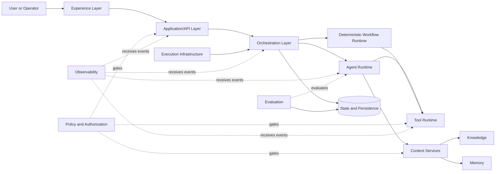
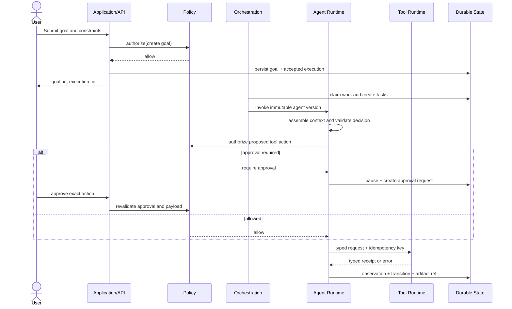

# System Architecture

## Purpose and constraints

This document defines logical responsibilities and dependency direction before technology selection. The architecture must support explicit execution state, policy enforcement, provider replaceability, durable long-running work, and evidence-backed outcomes. It does not prescribe deployable services; several layers may begin in one modular application.

## Context

The arrow diagram is a conceptual interaction view, not a network topology. Policy checks occur at every privileged boundary, not in a single perimeter component.

## Logical layers

| Layer | Responsibility | Inputs | Outputs | Depends on | Does not belong here |
|---|---|---|---|---|---|
| Experience | Goal entry, configuration, approval, trace inspection, manual takeover | View models, user actions | Commands and queries | Application/API | Business rules, direct database/tool calls, canonical workflow state |
| Application/API | Authenticate, validate commands, enforce application use cases, shape views | Authenticated requests/events | Domain commands, query results, accepted job IDs | Domain contracts, policy, persistence | Model prompts, tool credentials, long-running loops |
| Orchestration | Choose workflow/agent, decompose and schedule Tasks, coordinate dependencies and handoffs | Goals, Tasks, policies, execution events | Task assignments, transitions, escalations | Runtime interfaces, durable state, policy | UI rendering, provider-specific model code, direct connector code |
| Agent Runtime | Execute one bounded reasoning invocation/loop using an immutable Agent Definition | Task/Goal, assembled context, limits | Structured decisions, observations, artifacts, terminal outcome | Model adapter, context, tool runtime, policy | Global scheduling, unrestricted credentials, hidden state |
| Deterministic Workflow Runtime | Execute defined state/step transitions where reasoning is unnecessary | Versioned workflow, events, state | Step commands and durable transitions | Persistence, tools, agents through interfaces | Free-form planning inside every step |
| Tool Runtime | Validate, authorize, execute, rate-limit, and record deterministic actions | Typed request, identity, connection reference, idempotency key | Typed result/receipt/error | Policy, secret broker, connector adapter | Agent planning, raw model output, direct credential disclosure |
| Knowledge | Ingest, index, retrieve, cite, refresh, and delete governed source material | Sources, queries, access context | Provenance-bearing excerpts/facts | Storage, authorization | Episodic agent experience, execution status, treating embeddings as truth |
| Memory | Retain governed experience-derived information with scope, confidence, and expiry | Candidate memories, validation decisions, queries | Scoped memory entries/retrieval | Persistence, policy | Source documents, scratch state, unreviewed chain-of-thought |
| State/Persistence | Canonical product objects, versions, execution state, approvals, and references | Validated domain changes | Durable records and concurrency outcomes | Storage adapters | Secrets, large artifacts, telemetry payloads when specialized stores fit better |
| Policy & Authorization | Compute effective permissions, risk controls, approvals, and budgets | Actor, workspace, resource, action, context | Allow/deny/require-approval plus reason | Policy data, identity | Executing the action it authorizes, UI-only checks |
| Execution Infrastructure | Queue, schedule, lease, heartbeat, cancel, retry, and resume work | Durable commands/events | Worker dispatch and lifecycle signals | Persistence, orchestration | Domain policy, prompt construction, agent decisions |
| Observability | Correlated traces, metrics, structured logs, audit views, alerting | Sanitized events | Operational insight and alerts | Event/telemetry sinks | Canonical business state, secrets, hidden chain-of-thought |
| Evaluation | Score behavior and artifacts against versioned criteria | Execution artifacts, traces, fixtures, references | Scores, findings, regression gates | Evaluation store, runtime outputs | Runtime authorization, silently changing outputs |

## Key boundaries

### Commands and queries

External writes enter through application commands. Long-running commands return an identifier after durable acceptance. Queries read materialized or canonical state but never mutate runtime state.

### Runtime ports

The core runtime depends on interfaces for model invocation, context retrieval, tool execution, persistence, clock/IDs, policy, and event publication. Provider adapters implement those ports. This preserves deterministic tests and limits vendor-specific behavior.

### Event semantics

Domain events describe committed facts such as `TaskAssigned`, `ApprovalRequested`, or `ExecutionFailed`. Commands request changes. Telemetry reports operation detail. These are not interchangeable. Delivery may be at-least-once, so consumers must be idempotent.

### Source of truth

Canonical definitions and execution state live in validated persistent records. Queues, caches, search indexes, analytics stores, and graph projections are derived and rebuildable. External systems remain authoritative for their own objects; Connection metadata and receipts record what Agent Company OS observed.

## Primary execution flow

## Deployment evolution

Begin with a modular monolith plus separately scalable worker only if Stage 1 requirements support it. Preserve module boundaries in code and data access. Split services only for demonstrated isolation, scaling, ownership, or reliability needs; distributed systems add failure modes and should not be adopted decoratively.

## Candidate technology appendix (not decisions)

| Concern | Candidates | Relevant trade-offs / decision trigger |
|---|---|---|
| Web UI | React/Next.js with TypeScript | Product velocity and server rendering versus added framework conventions; decide when Stage 1 UI scope is clear. |
| Application/runtime | Python/FastAPI; Node/TypeScript | Python ecosystem and evaluation tooling versus end-to-end TypeScript contracts and async ecosystem; prototype the runtime boundary first. |
| Agent runtime | Custom bounded core; OpenAI Agents SDK; LangGraph; focused libraries | Control and transparency versus built-in orchestration/tracing; adopt libraries behind ports after requirements are tested. |
| Transactional storage | PostgreSQL | Strong relational/state-machine fit and isolation patterns; validate expected tenancy and event volume. |
| Semantic retrieval | PostgreSQL/pgvector; dedicated search/vector service | Simplicity versus search scale/features; retrieval quality and corpus size should drive choice. |
| Ephemeral coordination | Redis or database-backed leases | Operational overhead versus latency; do not add until load/resume requirements justify it. |
| Artifacts | Object storage | Appropriate for large immutable blobs; define retention and local-development substitute. |
| Durable jobs | Database queue; Temporal; Celery; BullMQ | Simple ownership versus durable workflow semantics and ecosystem/language fit; decide from cancellation, timers, and replay needs. |
| Integrations | Direct APIs, webhooks, OAuth connectors, MCP | Direct control versus interoperability; all must pass the same Tool Runtime and permission boundary. |

Technology selections require ADRs and evidence from the roadmap stage that needs them.
